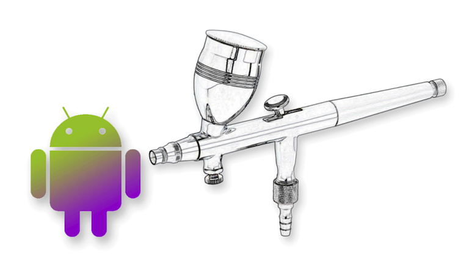
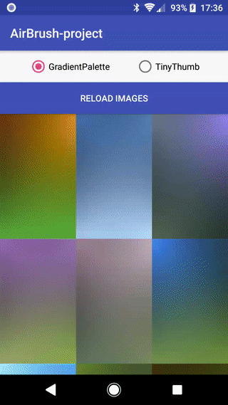

# AirBrush



_Be aware that **AirBrush** is still in development and applicable for breaking changes_

**AirBrush** is an Android library for simplifying the creation/handling of placeholder images that are shown while images are loading. Both pure gradients and tiny blurred images.
Esthetically gradients are very similar to a blurred version of the image they are representing. In fact that was the main driver behind **AirBrush**.
To esthetically approximate a blurred version of an image, without sending a lot of data.

## Sample app


Note that a gif can not do gradients justice.

## Challenges with loading images
In short: They are big. And it takes time for the client to download and render them.

Instead of just waiting for the image to load, many apps use default placeholder icons or random colors until the image has loaded. And while that looks
better than having nothing, it is still totally unrelated to the final image.

The perceived performance increases if we can show something that approximates the final image.

Depending on how much bandwidth you can use, the choice is yours.
In the server item response, as part of the metadata add a tiny 10x10 jpeg, or even just four colors!

### Gradient Palette - approximating the original image
The gradient consist of four colors, one for each corner.

The color palette is intended to be passed along with other meta data, such as the image URI.
This allows a client to display the gradient while it is loading a bigger image.
On devices with slow network connections, this is especially noticeable.

The implementation uses RenderScript and efficiently generates a Bitmap gradient from the color palette.

### TinyThumb - approximating the original image... even more

For the purpose of image loading placeholders, a four color gradient will approximate the original image quite nicely.
However, for an even better approximation a tiny e.g. 10x10 pixel image can be used. Compressed as JPEG and encoded as base64 it would be small.
Even smaller if the JPEG header could be omitted (i.e. added by the client). The client can then blur the image at runtime.
This is exactly what [Facebook's great blog post](https://code.facebook.com/posts/991252547593574/the-technology-behind-preview-photos)
talks about in greater detail. **AirBrush** provides its own implementation for doing this and it's called _TinyThumb_.

## Integration with [Glide]

AirBrush is an integration library for Glide and adds custom loaders for GradientPalette and TinyThumb.
Using a cross-fade between the images makes the transition look much better. See the sample app for implementation details.

Why use Glide? It's a stable library used by many and it provides great caching. Instead of reinventing the wheel so to speak, **AirBrush** uses Glide for simplicity and performance.

### Image Loading

For loading TinyThumb or GradientPalette with Glide, load it directly.
For TinyThumb:

```kotlin
val tinyThumb = getTinyThumb()
requestManager
        .load(imageUri)
        .thumbnail(requestManager.load(tinyThumb))
        .into(imageView)
```

For GradientPalette:
```kotlin
val gradientPalette = getGradientPalette()
requestManager
        .load(imageUri)
        .thumbnail(requestManager.load(gradientPalette))
        .into(imageView)
```

For generating a gradient without using the Glide components:
```kotlin
AirBrush(context).getGradient(gradientPalette, width, height)
```

### Clean up

**AirBrush** retains a shared instance of RenderScript for efficiency. If you're not going to use **AirBrush** for a while you can
clear any references by calling:
```kotlin
Airbrush.cleanup()
```

### Customizing AirBrush

_If you're not familiar with how Glide allows you to add/remove/replace loaders and resource decoders please have a [read here]._

AirBrush adds the necessary loaders and decoders for the two types _TinyThumb_ and _GradientPalette_.

```kotlin
/* LibraryGlideModule */
override fun registerComponents(context: Context, glide: Glide, registry: Registry) {
    registry.append(GradientPalette::class.java, GradientPalette::class.java, PaletteModelLoader.Factory())
    registry.append(GradientPalette::class.java, BitmapDrawable::class.java, GradientPaletteDecoder(context, glide.bitmapPool))

    registry.append(TinyThumb::class.java, TinyThumb::class.java, TinyThumbLoader.Factory())
    registry.append(TinyThumb::class.java, BitmapDrawable::class.java, TinyThumbDecoder(context, glide.bitmapPool) { bitmap ->
        AirBrush.blur(context, bitmap, scale = 1f, radius = 15f)
    })
}
```

If you want to change any of the loaders/decoders or simple want to adjust the blur you can do that in the app's AppGlideModule

```kotlin
/* AppGlideModule */
// This is how custom blurring can be achieved with AirBrush.
registry.prepend(TinyThumb::class.java, BitmapDrawable::class.java,  TinyThumbDecoder(context, glide.bitmapPool) { bitmap ->
    AirBrush.blur(context, bitmap, scale = 1f, radius = 20f)
})
```


### Utility methods

A fast blur implementation using RenderScript. This is used by TinyThumb by default.
```kotlin
AirBrush.blur(context, bitmap, scale, radius)
```

This is a convenience method for getting a GradientPalette while developing.
```kotlin
AirBrush.getPalette(bitmap);
```


Minimum SDK supported
---------------------
- 16


Dependencies (added by AirBrush)
--------------------------------
- [Glide] 4.3.1 or newer
- [RenderScript]
- [Palette]

Download
--------


```groovy
repositories {
    jcenter()
}

dependencies {
    implementation "com.subgarden.android:airbrush:0.6.0"
}
```

License
-------

    Copyright 2018 Fredrik Haugen Larsen

    Licensed under the Apache License, Version 2.0 (the "License");
    you may not use this file except in compliance with the License.
    You may obtain a copy of the License at

       http://www.apache.org/licenses/LICENSE-2.0

    Unless required by applicable law or agreed to in writing, software
    distributed under the License is distributed on an "AS IS" BASIS,
    WITHOUT WARRANTIES OR CONDITIONS OF ANY KIND, either express or implied.
    See the License for the specific language governing permissions and
    limitations under the License.

[Glide]: https://github.com/bumptech/glide
[RenderScript]: https://developer.android.com/guide/topics/renderscript/compute
[Palette]: https://developer.android.com/reference/android/support/v7/graphics/Palette
[read here]: https://bumptech.github.io/glide/tut/custom-modelloader.html